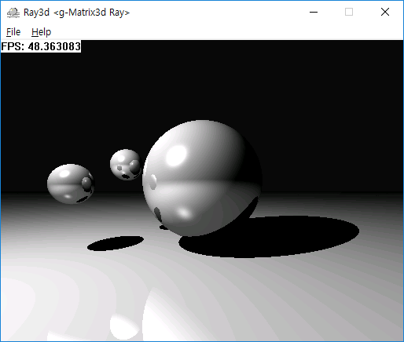

# Ray3d
- Simple Ray Tracer written in C++
- Basic graphics library is based on [g-Matrix3d neo 0.4.0](https://github.com/idgmatrix/g-matrix3d-neo)
- Renderer can run in up to 16 threads (C++ 11 thread used)
- threads menu added
- build by Visual Studio 2019

## screen shot

